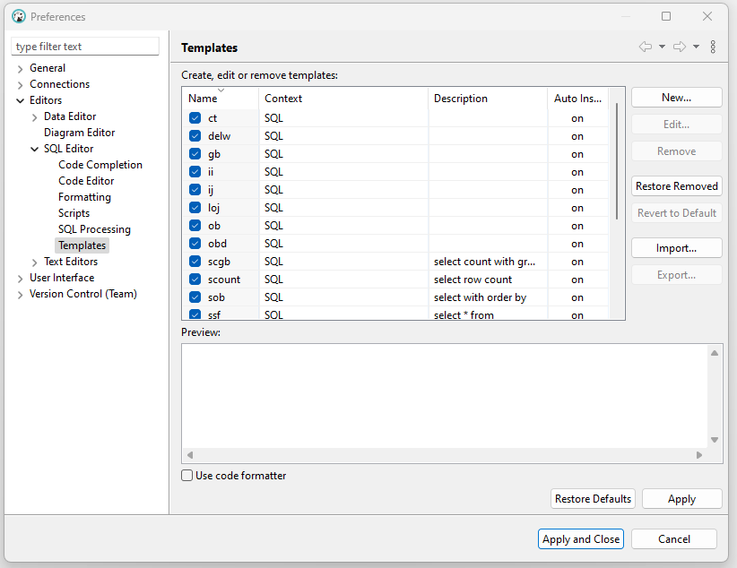
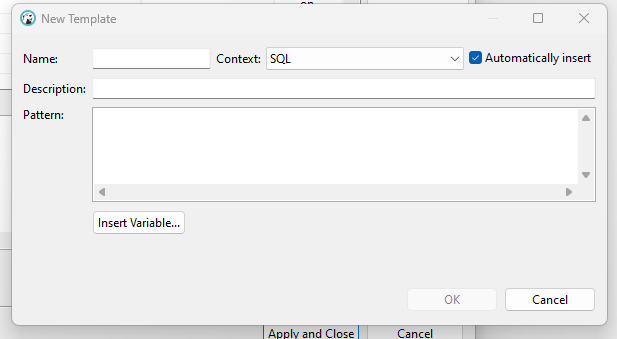
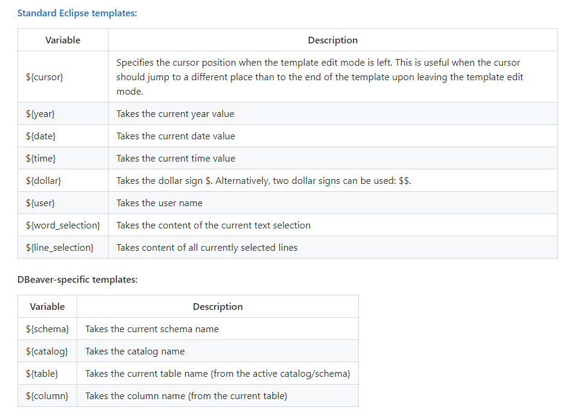
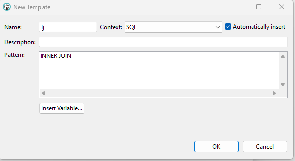
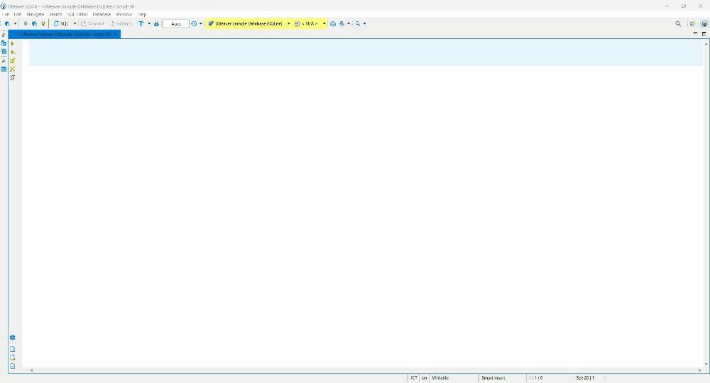

# HOW TO BRING THE SQL PROMPT SNIPPET TO THE DBEAVER

## I. Introduction

As a developer, you might work with various the different databases, and Dbeaver is a good choice for it. But one boring thing is you might write the same code every day, so the snippet is the hero for it.

If you have a chance to Sql prompt which is a paid plugin to SQL Server manage studio, you will love it.

Luckily, Dbeaver allows configuring the snippets like that. And I will show you how in the section below.

## II. How to generate or import the snippet

### 1. How to generate a new snippet

**Step 1**: From the Menu go to the `Window -> Preferences -> Editors -> SQL Editor -> Templates` and you will the new windows as the below.

**Step 2** : As you see in the new window.

On the left side, it will show you all the templates which are created or imported, and on the right-hand side is buttons that help you *create/ update/ remote/ import ....*

**Step 3**: Create a new snippet/ template
Click the button `New..` then a new window will display as below.

In the new window:

Field **Name:** is the shortcut to trigger the script which you want to place.

Field **Pattern** is the command which will display when you tye the shot cut.

Button **Insert Variable..** will show you all the build-in variables to insert into your template.

As you can see the picture below for the detailed information

This example can be explained **"When I type `lj` and press `tab`, the `INNER JOIN` statement will be filled**

### 2. How to import the existing snippet

By clicking the button `Import` and a new window will be displayed and you have to locate the location which places your template.

You can see in the folder `snippets` in this repository, I created a bunch of snippets, these snippets inspires by the SQL prompt snippet.

## III. References

Below is the links which are used to create the above content:

[Dbeaver Wiki](https://github.com/dbeaver/dbeaver/wiki/SQL-Templates)

[Sql Prompt Cheat Sheet](https://assets.red-gate.com/products/sql-development/sql-prompt/assets/sql-prompt-quick-reference.pdf)
